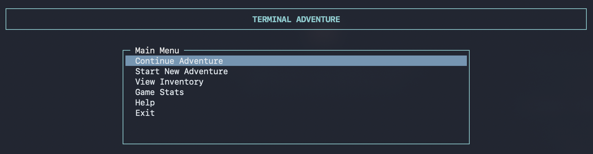
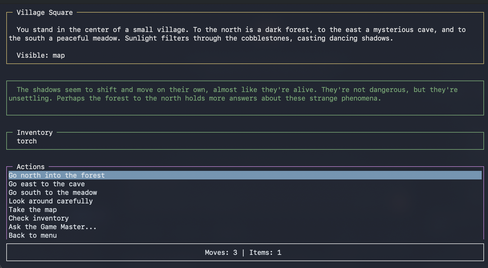
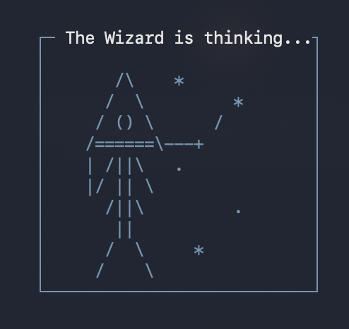

# Terminal App Template Generator

> Build SSH-accessible terminal applications with rich text user interfaces

## What is This?

A project generator and collection of demo applications for building SSH-based terminal apps with TUI (Text User Interface). It scaffolds a working Node.js project with an SSH server, screen-based navigation, session management, and reusable UI components -- all accessible via any standard SSH client.

## Features

- **SSH Server** -- anonymous or public key authentication
- **TUI Framework** -- rich terminal UI powered by blessed (lists, tables, forms, buttons)
- **Screen Router** -- declarative screen-to-screen navigation with automatic cleanup
- **Session Management** -- per-connection state with optional persistence to disk
- **Template Generator** -- `init.sh` scaffolds new projects with selectable app types
- **4 Demo Apps** -- fully working examples covering different use cases
- **Testing Suite** -- unit and E2E tests using Node.js built-in test runner

## Security Notice

All demo apps accept anonymous SSH connections and are intended for **local development and demonstration only**. They are not hardened for production or public-facing deployment. If you expose a server to the internet, implement proper authentication, rate limiting, and access controls.

## Demo Apps

### demo-shop -- E-commerce

A terminal-based storefront with product catalog, shopping cart, and checkout flow. Demonstrates forms, tables, and multi-screen workflows.

### adventure-game -- Text RPG with LLM Integration

An interactive text adventure powered by a Game Master LLM via Ollama.

<p align="center">
  
</p>

<p align="center">
  
</p>

<p align="center">
  
</p>

Features include:

- LLM-powered narrative generation (configurable model via `OLLAMA_MODEL`)
- Session persistence across server restarts (saved to `data/sessions.json`)
- Resume and continue support -- reconnect and pick up where you left off
- Free-text input to the Game Master alongside suggested actions
- Animated wizard loading screen while the LLM responds
- Deterministic simulation + strict narration contract (fast-fail on invalid LLM payloads)

### admin-dashboard -- System Monitoring

A server monitoring dashboard with screens for system overview, running processes, resource usage, logs, network information, services, and settings.

### animation-demo -- Terminal Animations

A standalone ASCII animation showcase. Displays multiple frame-based animations with speed control, pause/play, and keyboard navigation. Useful as a reference for building loading screens and visual effects.

## Quick Start

### Command Convention

For apps that live inside this repository (`demo-shop`, `adventure-game`, `admin-dashboard`, `animation-demo`), use the local npm wrapper:

```bash
./npmw <command>
```

This wrapper auto-loads `nvm` if your shell PATH does not include `node`/`npm`.
Plain `npm ...` commands still work when `node`/`npm` are already available in PATH.

### Generate a New App

```bash
chmod +x init.sh

# Create a minimal starter app
./init.sh my-app

# Create an e-commerce app with full product/cart/checkout screens
./init.sh my-app ecommerce

# Explicitly request a minimal template
./init.sh my-app minimal
```

### Run a Generated App

For generated apps, use plain `npm ...` commands (or load nvm first if `npm` is missing).

```bash
cd my-app
npm install
npm run generate-keys
npm start
```

### Run a Demo App

```bash
cd demo-shop          # or adventure-game, admin-dashboard
./npmw install
./npmw run generate-keys
./npmw start
```

### Connect

```bash
ssh localhost -p 2222
```

Each app runs on port 2222 by default (configurable via `SSH_PORT` in `.env`).

## Project Structure

```
shellcraft/
├── init.sh                  # Template generator script
├── quick-start.sh           # One-liner setup helper
├── demo-shop/               # E-commerce demo app
├── adventure-game/          # Text RPG with LLM integration
├── admin-dashboard/         # System monitoring dashboard
├── animation-demo/          # ASCII animation showcase
├── USAGE_GUIDE.md           # Detailed usage documentation
├── QUICK_REFERENCE.md       # Quick reference for common tasks
└── DESIGN_PRINCIPLES.md     # Design principles for SSH/blessed apps
```

### Generated App Structure

```
my-app/
├── src/
│   ├── server/
│   │   ├── index.js         # SSH server entry point
│   │   ├── router.js        # Screen navigation router
│   │   └── session.js       # Session management
│   ├── ui/
│   │   ├── components.js    # Reusable UI components
│   │   ├── home.js          # Home screen
│   │   └── ...              # Additional screens
│   └── models/              # Data models
├── test/
│   ├── unit/                # Unit tests
│   ├── e2e/                 # End-to-end tests
│   └── helpers/             # Test utilities
├── keys/                    # SSH host keys (generated, gitignored)
├── scripts/
│   └── generate-keys.js     # RSA key pair generator
├── package.json
├── .env.example
└── .gitignore
```

## Technology Stack

- **[ssh2](https://github.com/mscdex/ssh2)** -- SSH server implementation
- **[blessed](https://github.com/chjj/blessed)** -- Terminal UI framework
- **[dotenv](https://github.com/motdotla/dotenv)** -- Environment configuration
- **[nanoid](https://github.com/ai/nanoid)** -- Unique ID generation

The adventure-game additionally uses **Ollama** for local LLM inference (not bundled as an npm dependency; runs as a separate service).

## Creating a Custom Screen

```javascript
// src/ui/myscreen.js
import { UIComponents } from './components.js';

export class MyScreen {
  constructor(context) {
    this.context = context;
    this.screen = context.screen;
    this.render();
  }

  render() {
    const menu = UIComponents.createList({
      parent: this.screen,
      top: 'center',
      left: 'center',
      width: '50%',
      height: 10,
      label: ' My Menu ',
      items: ['Option 1', 'Option 2', 'Option 3']
    });

    menu.on('select', (item, index) => {
      UIComponents.showMessage(
        this.screen,
        `Selected: ${item}`,
        'success'
      );
    });

    this.screen.key(['escape'], () => {
      this.context.navigate('home');
    });
  }
}
```

Register the screen in `src/server/router.js`:

```javascript
import { MyScreen } from '../ui/myscreen.js';

this.screens = {
  home: HomeScreen,
  myscreen: MyScreen,
  // ...
};
```

## Customization

- **Screens** -- Add or modify screens in `src/ui/`
- **Models** -- Update data models in `src/models/`
- **Styling** -- Blessed supports 256 colors and multiple border types
- **Authentication** -- Customize in `src/server/index.js`
- **Session Data** -- Extend the session object in `src/server/session.js`

## Deployment

### Local Development

```bash
./npmw run dev  # Uses nodemon for auto-reload
```

### Production (PM2)

```bash
pm2 start src/server/index.js --name my-app
pm2 startup
pm2 save
```

### Docker

```bash
docker build -t my-app .
docker run -p 2222:2222 my-app
```

## Documentation

- **[USAGE_GUIDE.md](./USAGE_GUIDE.md)** -- Complete guide with examples and tutorials
- **[QUICK_REFERENCE.md](./QUICK_REFERENCE.md)** -- Quick reference for common tasks
- **[DESIGN_PRINCIPLES.md](./DESIGN_PRINCIPLES.md)** -- Design principles for SSH/blessed apps

## One-Liner Setup

```bash
./init.sh my-app && cd my-app && npm i && npm run generate-keys && npm start
```

Then connect: `ssh localhost -p 2222`

If `npm` is not found in your shell, load nvm first:
`source ~/.nvm/nvm.sh && nvm use default`.

## License

MIT License -- free to use for any project, commercial or personal.
